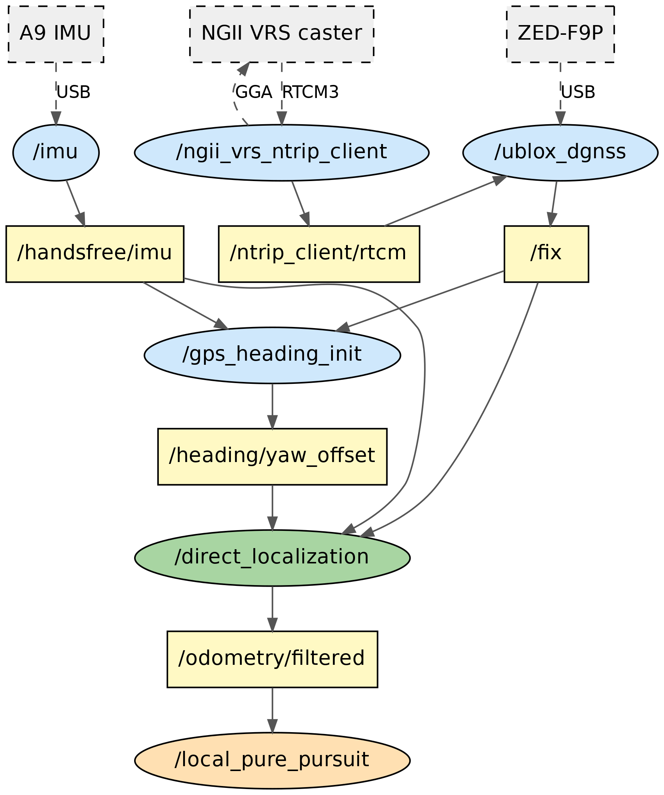
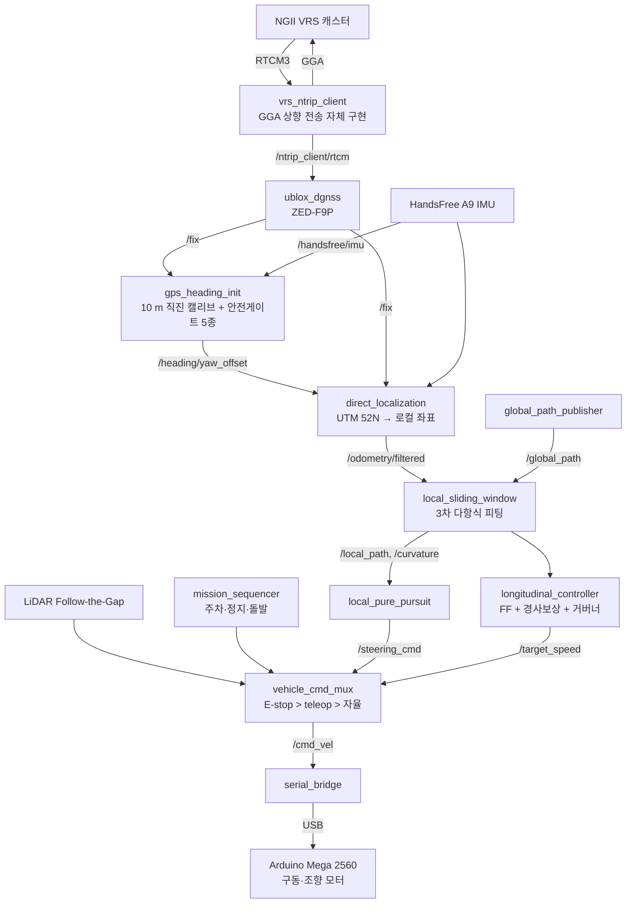
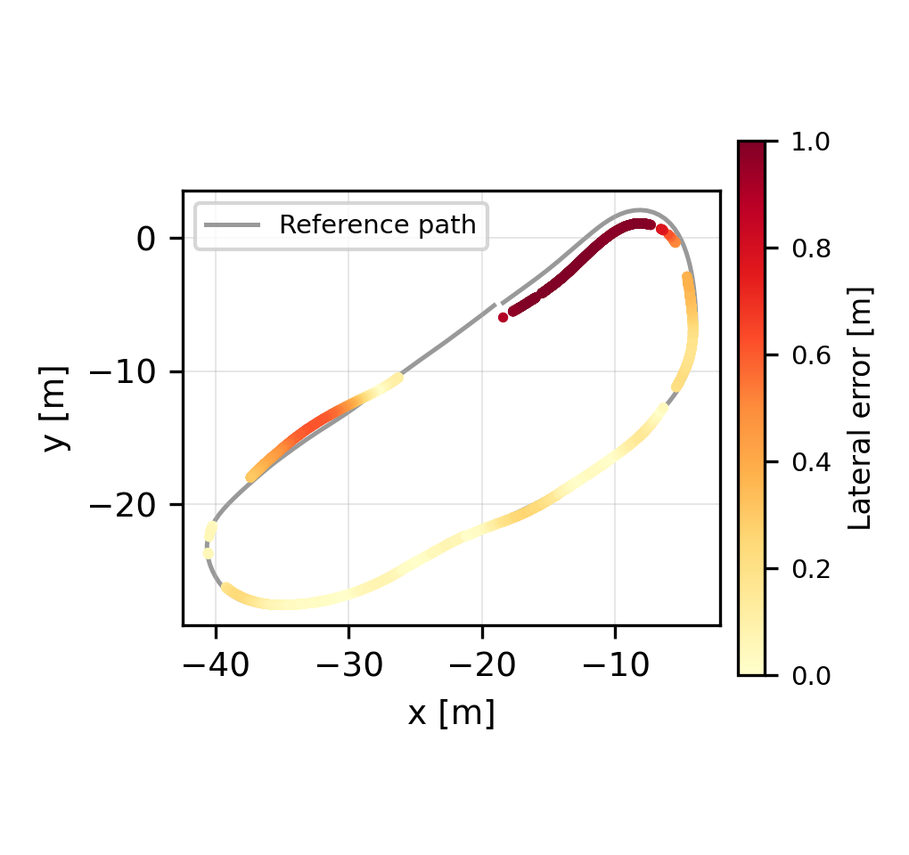
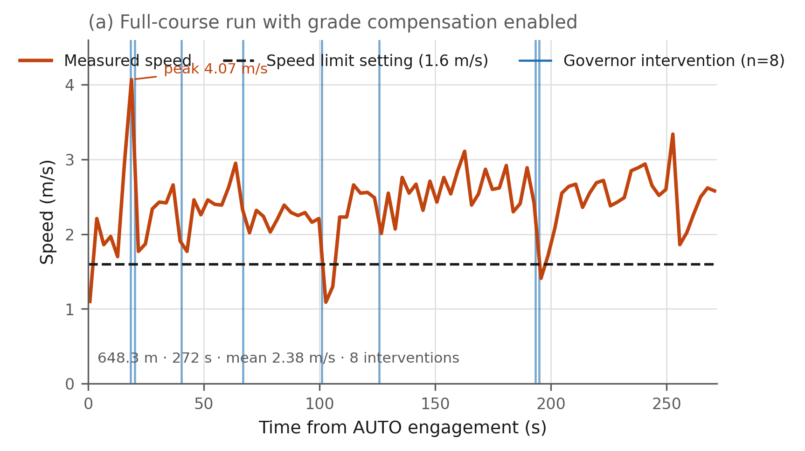
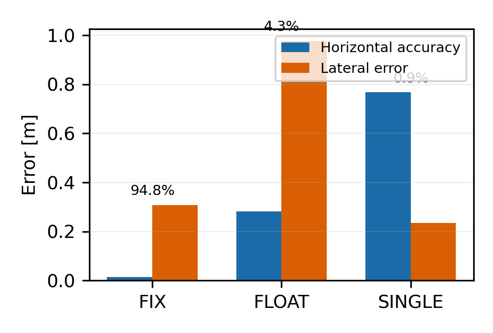
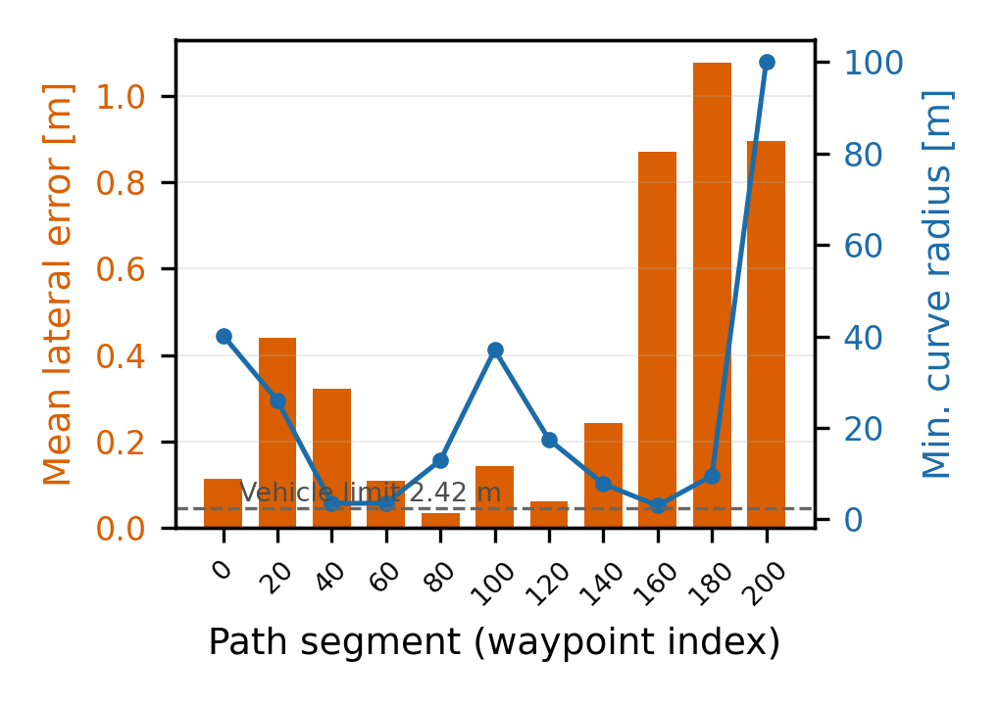
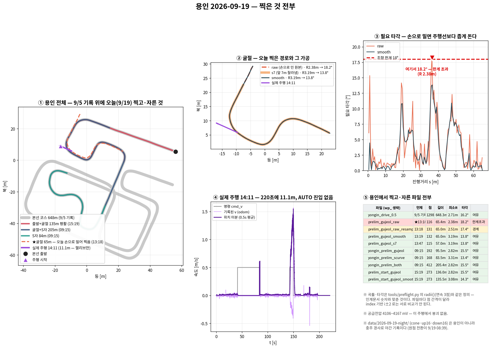

# 저비용 RTK-GNSS 자율주행 플랫폼 — HENES T870 개조차

> **유아용 전동차(축거 0.785 m)를 개조해 RTK-GNSS 측위부터 경로 추종, 미션 수행까지 직접 구현한 ROS 2 자율주행 스택입니다.**
> 2026 영남대 자율주행 경진대회 **특별상** · 2026 HL만도 FMA(용인운전면허시험장) 본선 **무개입 완주**


---

## English Summary

| | |
|---|---|
| **What** | A full autonomous-driving stack (ROS 2 Humble) built on a converted kids' electric ride-on car (HENES T870) |
| **Localization** | u-blox ZED-F9P + Korean NGII VRS corrections over NTRIP. Includes a custom NTRIP client with **GGA uplink**, which the stock ROS 2 driver lacks |
| **Heading** | IMU yaw aligned to the map by a **10 m straight-line GNSS-course calibration**, protected by 5 safety gates |
| **Control** | Local sliding-window cubic fit + Pure Pursuit (lateral), feed-forward + **IMU-pitch grade compensation** + reverse-PWM governor (longitudinal) |
| **Missions** | Reverse parking (Dubins planner), crosswalk stop, sudden-obstacle stop, LiDAR Follow-the-Gap avoidance, traffic light (RPi 5 + Hailo-8) |
| **Results** | RTK Fixed **94.8 %**, horizontal accuracy **1.4 cm**, heading error **1.02°** · **648.3 m** full course finished with no human input in **271.9 s** (avg 2.38 m/s) |
| **Awards** | Special Award, 2026 Yeungnam Univ. Autonomous Driving Competition · Completed the 2026 HL Mando FMA main race |

---

## 1. 프로젝트 개요

| 항목 | 내용 |
|---|---|
| 기간 | 2026-07 ~ 2026-09 (약 3개월, 커밋 240여 개) |
| 역할 | 개인 개발: 하드웨어 개조, 펌웨어, ROS 2 전 계층, 현장 시험, 논문 작성 |
| 플랫폼 | HENES T870 유아용 전동차 개조 (축거 0.785 m, 최대 타각 18°) |
| 목표 | 고가 INS나 이중 안테나 없이 **cm급 측위**와 **실제 대회 코스 완주**를 동시에 달성 |
| 핵심 가치 | 저가 부품만으로 대회 수준의 안정성을 확보하는 설계 방법론. 정리하면 "예측하지 말고 측정한다"는 원칙입니다. |

### 대회·연구 성과

| 구분 | 내용 | 결과 |
|---|---|---|
| 🏆 대회 | 2026 영남대 자율주행 경진대회 (대구권, 190 m 코스) | **특별상** |
| 🏁 대회 | 2026 HL만도 FMA (용인운전면허시험장 1종 대형 기능코스 648 m) | **본선 무개입 완주** |
| 📄 논문 | RTK-GNSS 기반 저비용 자율주행 플랫폼의 실시간 측위 시스템 구현 | [`paper/ITS논문_최종.md`](paper/ITS논문_최종.md) |
| 📄 논문 초안 | RTK-GNSS/IMU 로컬라이제이션 + IMU 피치 기반 경사 전방보상 결합 | [`docs/papers/`](docs/papers/논문초안_측위-경사보상_결합.md) |

### 핵심 성능 지표 (실차 실측)

| 지표 | 값 | 의미 |
|---|---|---|
| RTK Fixed 유지율 | **94.8 %** | 주행 중 cm급 해를 유지한 비율 |
| 수평 정확도(평균) | **1.4 cm** | 차선 폭 대비 오차가 무시할 수준 |
| 방위각 오차(중앙값) | **1.02°** | 초기화 전 −134.7° → 초기화 후 +1.02° |
| 직선 구간 횡방향 오차 | **3 ~ 14 cm** | 경로 추종 정밀도 |
| 본선 완주 | **648.3 m / 271.9 s** | 평균 2.38 m/s, 최고 4.07 m/s, 사람 개입 0회 |
| 경사 보상 효과 | 역 PWM 인가율 **38.6 % → 거버너 개입 8회** | 경사로 속도 진동 억제 |
| 조향 포화 | **0회** | 경로 평활화로 물리적으로 주행 가능한 경로만 사용 |

---

## 2. 시스템 구조





### 설계 원칙

| 원칙 | 구현 | 실무 가치 |
|---|---|---|
| **Fail-safe 측위** | 센서 두절 시 마지막 값을 유지하지 않고 발행을 중단합니다. 하위 노드는 타임아웃을 감지해 정지합니다. | 잘못된 위치로 달리는 사고를 구조적으로 차단 |
| **단일 출구(Single Exit)** | 모든 명령이 `vehicle_cmd_mux`를 거치며 E-stop → teleop → 자율 순으로 우선합니다. | 미션 코드를 추가해도 완주 코드를 수정하지 않음 (회귀 위험 0) |
| **단일 정본(Single Source of Truth)** | 좌표 원점은 `config/site_origin.yaml` 하나만 둡니다. | 장소 변경 시 150 km 좌표 오류 재발 방지 |
| **측정 기반 튜닝** | 파라미터를 전부 실측으로 정합니다 (축거, 조향 counts/도, 추진력 계수, 구름저항). | 현장 시행착오 시간 단축 |

---

## 3. 기술 스택

| 계층 | 기술 | 비고 |
|---|---|---|
| 측위 | u-blox ZED-F9P, NTRIP/RTCM3, NGII VRS, UTM(EPSG:32652) | GGA 상향 전송 클라이언트 자체 구현 |
| 자세 | HandsFree A9 IMU (300 Hz) | yaw는 방위각, pitch는 경사 보상에 사용 |
| 경로 계획 | 슬라이딩 윈도우 3차 피팅, 반복 평활화, Dubins 경로 | 곡률 한계 내 경로만 생성 |
| 제어 | Pure Pursuit, 피드포워드 + PID, 경사 FF, 역 PWM 거버너 | 개루프 구동계 대응 |
| 인지 | 2D LiDAR (DBSCAN, Hungarian tracker, Follow-the-Gap), RPi 5 + Hailo-8 신호등 | 미션용 |
| 하위 제어 | Arduino Mega 2560, LS7366R SPI 엔코더 카운터, DC 조향 + 포텐셔미터 | 펌웨어 직접 작성 |
| 미들웨어 | ROS 2 Humble, colcon, rosbag2 | Ubuntu 22.04 |
| 검증 | HIL(Hardware-in-the-Loop) 시뮬, 단위 테스트 20여 개, 주행 로그 분석 도구 | `tools/` |

---

## 4. 문제 해결 사례 (STAR)

현장에서 실제로 부딪힌 문제를 **상황 → 과제 → 행동 → 결과**로 정리했습니다. 상세 근거는 `PROJECT_HANDOVER.md`와 `HANDOFF_*.md`에 있습니다.

### 4.1 VRS 보정 수신 불가 → NTRIP 클라이언트 자체 구현

| 단계 | 내용 |
|---|---|
| **S** | 국토지리정보원 VRS는 이동체 위치(GGA)를 받아야 보정 신호를 생성합니다. 기존 `ublox_dgnss` 패키지는 RTCM 하향 수신만 지원했습니다. |
| **T** | RTK Fixed로 수렴시켜 cm급 측위를 확보해야 했습니다. |
| **A** | HTTP Basic 인증, 주기적 GGA 상향 전송, RTCM 재발행을 포함한 `vrs_ntrip_client`를 직접 구현했습니다. |
| **R** | RTK Fixed **94.8 %**, 수평 정확도 **1.4 cm**를 달성했고, 논문의 핵심 기여 1번이 되었습니다. |

### 4.2 IMU 방위각이 지도와 안 맞음 → GNSS 이동방향 기반 초기화

| 단계 | 내용 |
|---|---|
| **S** | 모터가 가까워 자력계가 왜곡되었고, IMU yaw는 부팅할 때마다 리셋되었습니다. 초기화 전 오차는 −134.7°였습니다. |
| **T** | 이중 안테나 없이 지도 좌표계 방위각을 구해야 했습니다. |
| **A** | 10 m 직진 중 GNSS course와 IMU yaw의 차이로 오프셋을 추정했습니다. 직진은 yaw 변화량 폐루프로 유지하고, 안전게이트 5종(RTK 수렴, 점프 속도, 소요시간, 편차 상한, 앞바퀴 정렬)을 추가했습니다. |
| **R** | 방위각 오차 **1.02°**. 게이트 도입 후 연석 충돌이 재발하지 않았습니다. |

### 4.3 제어가 완벽해도 이탈하는 경로 → 곡률 제약 평활화

| 단계 | 내용 |
|---|---|
| **S** | 최소 회전반경은 2.42 m(0.785/tan 18°)인데, 기록 경로에 R = 1.73 m 구간이 있었습니다. |
| **T** | 원래 경로에서 크게 벗어나지 않으면서 물리적으로 주행 가능한 경로를 만들어야 했습니다. |
| **A** | 이탈량을 제한한 반복 평활화 `p ← p + α(p⁰−p) + β(p₋ + p₊ − 2p)`를 구현했습니다. 리샘플 간격을 0.3 m로 줄이면 오히려 GPS 노이즈가 곡률로 드러난다는 점도 발견했습니다. |
| **R** | 최소 R **1.73 → 2.81 m**, 주행 불가 구간 **0개**, 평균 이동량 0.09 m, 조향 포화 **0회**. |

### 4.4 "경로 끊김"으로 차가 멈춤 → 상류 추적으로 근본 원인 규명

| 단계 | 내용 |
|---|---|
| **S** | 헤딩 캘리브는 성공했는데 `/curvature` 끊김 경고와 함께 차가 움직이지 않았습니다. |
| **T** | 증상이 나타난 노드가 아니라 실제 원인을 찾아야 했습니다. |
| **A** | 토픽을 상류로 한 단계씩 추적했습니다: `/curvature` → `/odometry/filtered` 발행 중단 → `imu_lost` 가드 → 커널 로그. USB 허브 3단 경유로 IMU가 8~24초마다 끊기는 것을 확인했습니다. |
| **R** | IMU를 노트북에 직결해 코드 수정 없이 해결했습니다. **안전 로직이 설계대로 동작했음**도 함께 확인했습니다. |

### 4.5 경사로에서 속도 진동 → IMU 피치 기반 경사 전방보상

| 단계 | 내용 |
|---|---|
| **S** | 개루프 구동계라서 오르막에서는 속도가 떨어지고 내리막에서는 과속했습니다. 보상이 없을 때 PWM이 +60 ~ −51 범위를 오가며 한계주기가 발생했습니다. |
| **T** | 속도 센서 신뢰도가 낮은 조건에서 경사 구간을 안정적으로 통과해야 했습니다. |
| **A** | 경사를 먼저 측정했습니다(시험장 18 %, 법정 경사로 10 ~ 12.5 %). 실측 물성(추진력 계수 k = 0.0202, 구름저항 f = 0.733)으로 IMU 피치 → 중력 상쇄 PWM 전방보상을 설계하고, 남는 편차는 역 PWM 거버너로 흡수했습니다. |
| **R** | 역 PWM 인가율 38.6 % → 본선 271.9 초 동안 **거버너 개입 8회**. 5시간 걸리던 원인 분석이 **경사 측정 후 10분**으로 줄었습니다. |

### 4.6 엔코더 무신호 → 전수 배제로 하드웨어 원인 확정

| 단계 | 내용 |
|---|---|
| **S** | 엔코더 값이 0으로 고정되었고, 스톨 가드가 정상 주행을 스톨로 오인해 700 ms마다 동력을 차단했습니다. |
| **T** | 소프트웨어와 하드웨어 중 어디가 원인인지 가려야 했습니다. |
| **A** | 진단용 펌웨어 15종(`arduino/`)으로 SPI CS 29핀, 아날로그 A0~A15, UART 3포트 × 5보드레이트, I2C를 전수 스캔했습니다. 정지 상태 대조군으로 노이즈 오판도 막았습니다. |
| **R** | 드라이버 보드에 **LS7366R 카운터 IC가 없음**을 확정했습니다. 보드를 교체한 즉시 엔코더가 복구되었고, 보드 판별 도구 `board_id.ino`를 표준 절차로 만들었습니다. |

### 그 밖의 사례 요약

| 문제 | 원인 | 조치 |
|---|---|---|
| 좌회전이 78 %만 꺾임 | 조향 링키지 좌우 비대칭 (26.2 / 20.6 counts/도) | 방향별 스케일 분리 → 좌우 차이 0.2° |
| 소스를 고쳐도 옛 동작 | `--symlink-install`이어도 `build/`에 복사본이 남음 | 소스·설치본 diff 검증 스크립트 도입 |
| 로컬 좌표가 150 km 어긋남 | 원점이 5곳에 하드코딩됨 | 단일 정본 + 공통 로더, 불일치 시 거부 |
| 캘리브 중 차가 안 나감 | teleop 데드맨이 같은 토픽에 0을 덮어씀 | 실행 순서를 런북으로 고정 (`VERIFIED_LAP.md`) |
| 주행 중 PWM이 튐 | `serial_bridge` 좀비 프로세스 2개가 같은 포트에 동시 기록 | `ros_cleanup.sh`, CSV로 PWM 이중값 판별 |

---

## 5. 결과 시각화

| 경로 추종 횡오차 (영남대 코스) | 경사 보상 적용 본선 주행 (용인 648 m) |
|---|---|
|  |  |

| RTK 품질 | 구간별 오차 |
|---|---|
|  |  |



---

## 6. 저장소 구조

```
racing_ws/
├── src/                       # ROS 2 패키지
│   ├── gps_localization/      #   bringup 런치, direct_localization (측위 융합)
│   ├── gps_heading_init/      #   10 m 직진 방위각 캘리브 + 안전게이트
│   ├── ngii_ntrip/            #   VRS NTRIP 클라이언트 (GGA 상향 전송)
│   ├── waypoint_follower/     #   전역 경로, 로컬 슬라이딩 윈도우, 웨이포인트 기록
│   ├── pure_pursuit_pkg/      #   횡방향 경로 추종
│   ├── velocity_controller/   #   종방향 제어, 명령 mux, 시리얼 브리지, teleop
│   ├── mission_perception/    #   주차(Dubins)·횡단보도·돌발정지·신호등, RPi 배포 코드
│   └── lidar_clustering/      #   DBSCAN + Hungarian 추적 + Follow-the-Gap
├── arduino/                   # 차량 펌웨어 + 하드웨어 진단 스케치 15종
├── tools/                     # 주행 로그 분석, HIL, 경로 평활화, 단위 테스트
├── config/                    # 장소별 원점·웨이포인트·미션 계획 (충주/대구/용인)
├── data/                      # 대회 전후 실차 주행 기록
├── paper/                     # ITS 논문 원고·그림
├── docs/                      # 포트폴리오 이미지, 두 번째 논문 초안
├── legacy/                    # 초기(2026-07) 좌표 변환·웨이포인트 도구 (빌드 제외)
├── PROJECT_HANDOVER.md        # ★ 전체 인계 문서 (하드웨어 함정, 해결 사례, 절대 규칙)
├── VERIFIED_LAP.md            # ★ 본선 완주 명령과 근거
└── HANDOFF_YYYY-MM-DD.md      # 일자별 현장 작업 기록
```

---

## 7. 실행 방법

### 빌드

```bash
cd ~/racing_ws
colcon build --symlink-install
source install/setup.bash
```

> ⚠ 소스를 고친 뒤에는 **반드시 다시 빌드**하세요. `build/`에 옛 복사본이 남는 사례가 있었습니다 (4장 참고).

### NTRIP 계정 설정 (저장소에는 계정을 저장하지 않습니다)

```bash
export NGII_ID='발급받은_아이디'
export NGII_PW='비밀번호'
```

### 본선 주행 (용인 648 m, 인자 일부 생략)

```bash
bash tools/ros_cleanup.sh                     # 1) 잔여 프로세스 정리
ros2 launch gps_localization bringup.launch.py \
  control:=true auto_calib:=true rviz:=true \
  waypoints:=$HOME/racing_ws/config/yongin_2026-09-05/wp_yongin_drive_0.5.yaml \
  max_speed:=1.6 curvature_gain:=6.0 ff_mode:=ros \
  grade_ff_gain:=1.0 gov_pwm:=60.0            # 2) 5초 뒤 자동 10 m 캘리브 → AUTO
ros2 run velocity_controller teleop_keyboard   # 3) "모드: AUTO"가 뜬 뒤에 비상정지용으로 실행
```

전체 인자와 출발 전 체크리스트는 [`VERIFIED_LAP.md`](VERIFIED_LAP.md)에 있습니다.

### HIL 시뮬레이션 (차량 없이 검증)

```bash
ros2 launch gps_localization hil.launch.py
python3 tools/preflight.py     # 경로·주차 계획 가능 여부 사전 점검
```

---

## 8. 문서 안내

| 문서 | 용도 |
|---|---|
| [`PROJECT_HANDOVER.md`](PROJECT_HANDOVER.md) | 전체 구조, 하드웨어 실측값, 해결 사례, 절대 규칙 |
| [`VERIFIED_LAP.md`](VERIFIED_LAP.md) | 본선 완주 명령, 실패 시 대응표 |
| [`PLAN_HL_FMA_2026.md`](PLAN_HL_FMA_2026.md) | 대회 규정 분석, 8분 시간 예산, 리스크 기반 우선순위 |
| [`RAMP_RUNBOOK.md`](RAMP_RUNBOOK.md) | 경사로 시험 절차 |
| `HANDOFF_*.md` | 일자별 현장 기록 (원인·조치·근거) |
| [`paper/`](paper/) | ITS 논문 원고와 그림 |
| [`legacy/`](legacy/README.md) | 초기 좌표 변환·웨이포인트 도구 |

---

## 9. 배운 점

| 교훈 | 사례 |
|---|---|
| **예측하지 말고 측정한다** | 경사를 재지 않고 PWM만 바꾸다 5시간을 썼고, 경사를 잰 뒤 10분 만에 해결했습니다. |
| **증상이 아니라 상류를 본다** | "경로 끊김"의 원인은 IMU USB 허브였습니다. |
| **안전 로직은 조용히 실패한다** | teleop 데드맨, 좀비 브리지, 빌드 복사본은 모두 에러 메시지 없이 동작을 막았습니다. 그래서 런북과 사전 점검 도구로 대응했습니다. |
| **리스크 기반 우선순위** | 규정을 분석해 "탈락 조건 4개 회피"를 최우선으로 두고, 감점 미션은 그다음에 배치했습니다. |

---

## Author

**한재민 (Han Jae-min)** · 국립한국교통대학교 전자공학과
GitHub [@hanmin0211](https://github.com/hanmin0211)
