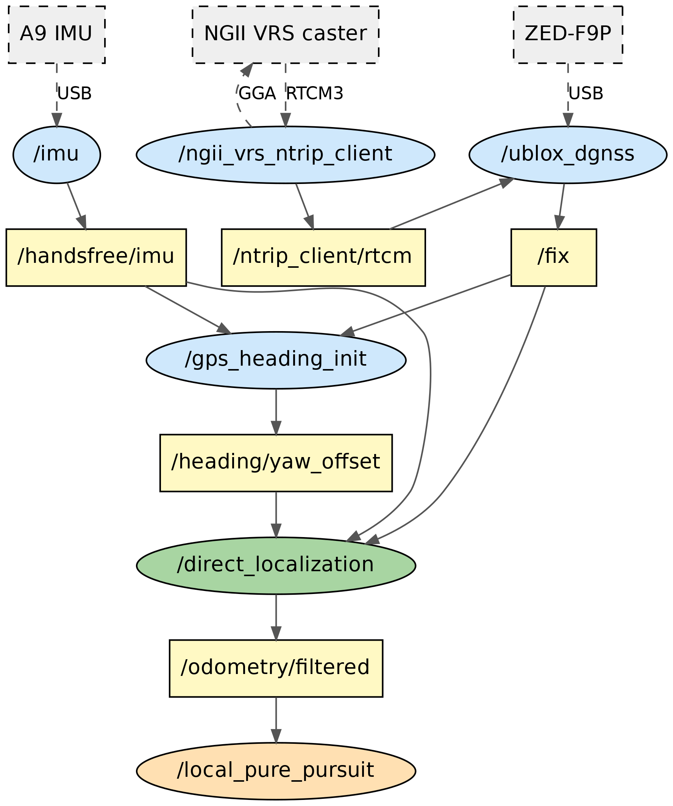
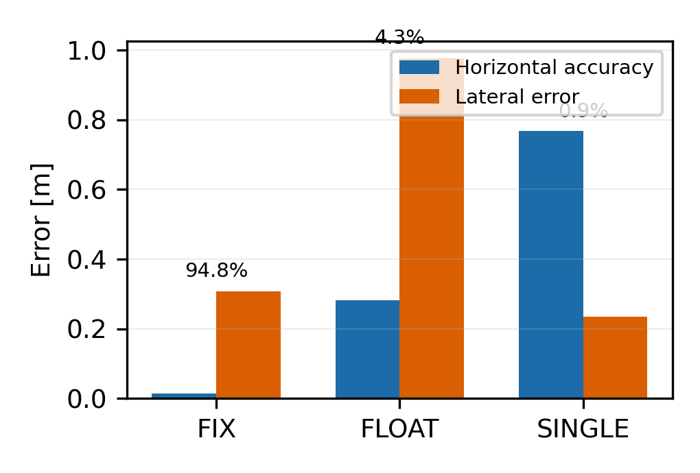
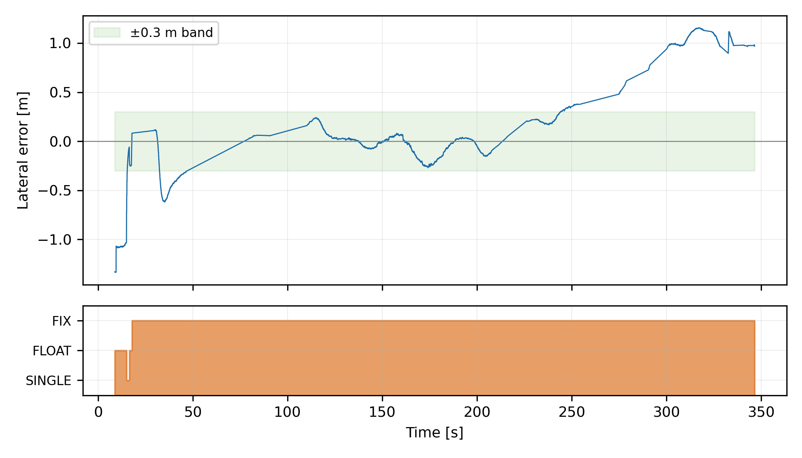
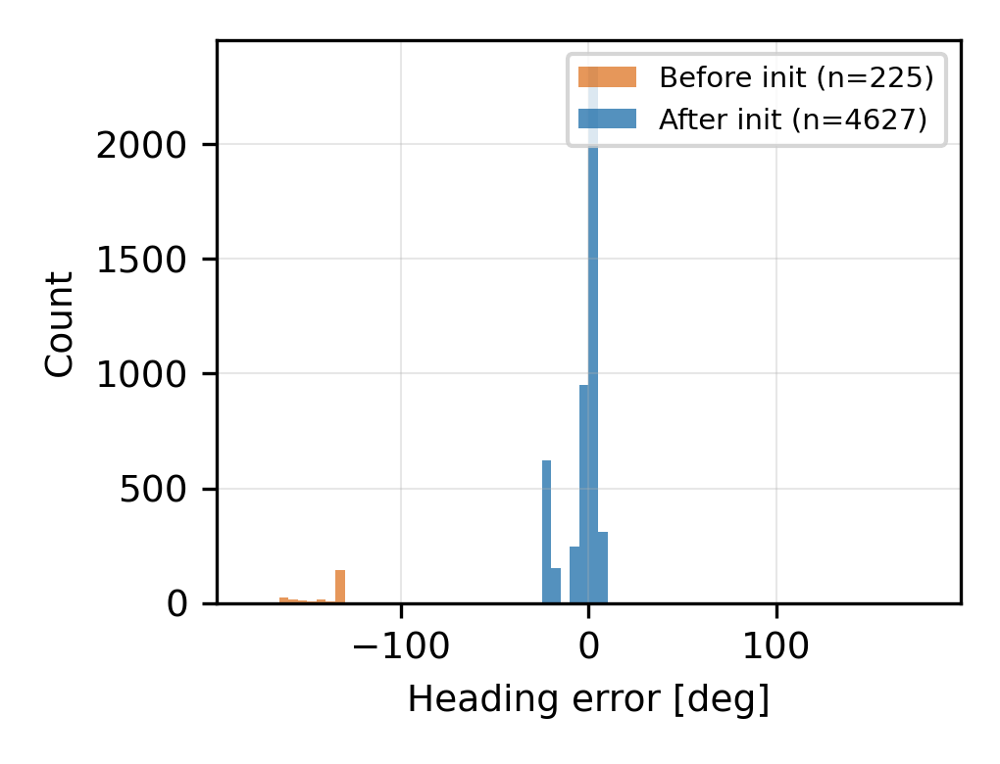
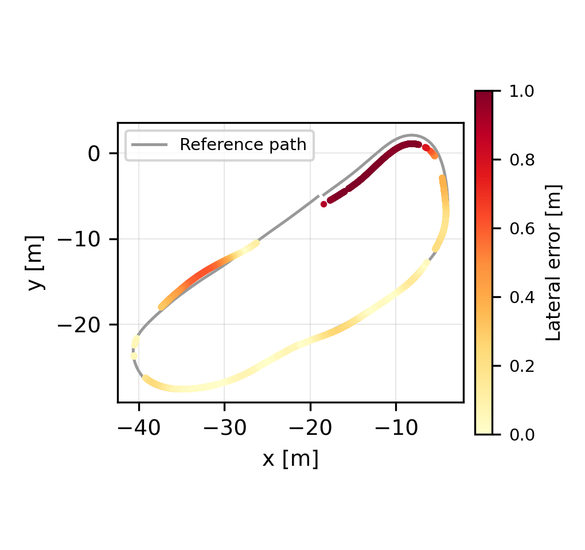
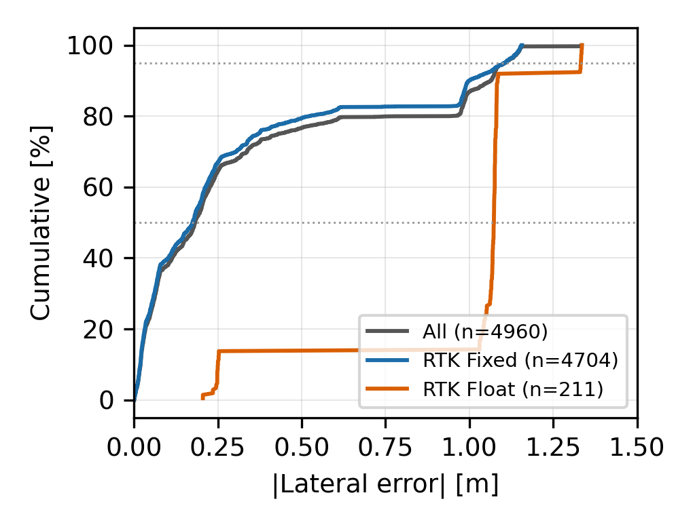
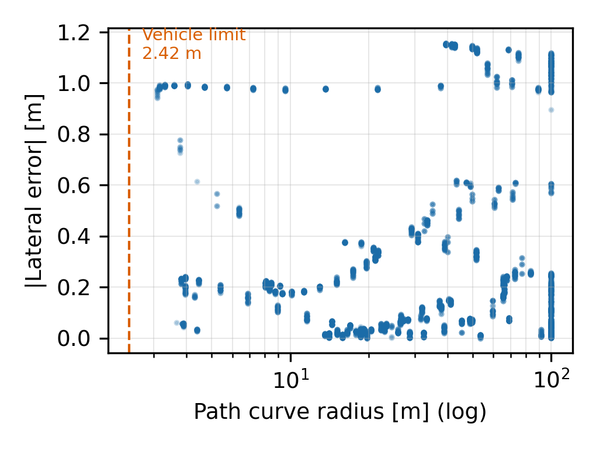
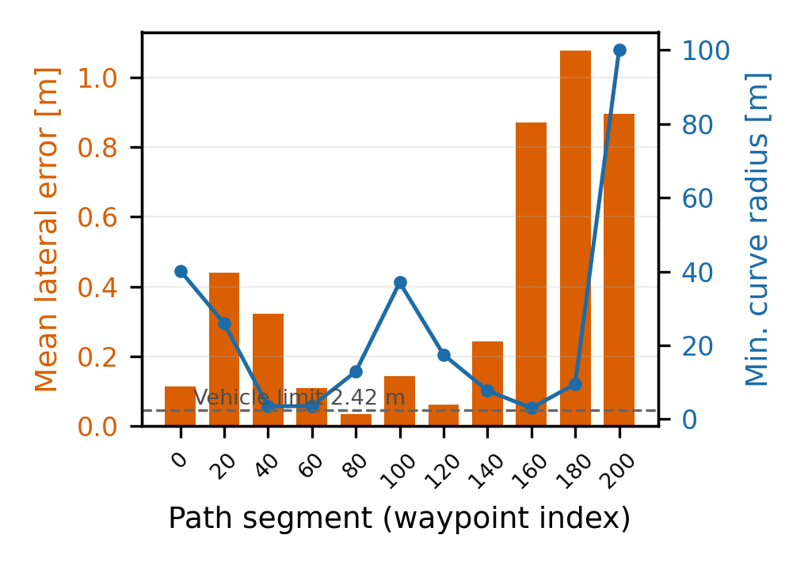
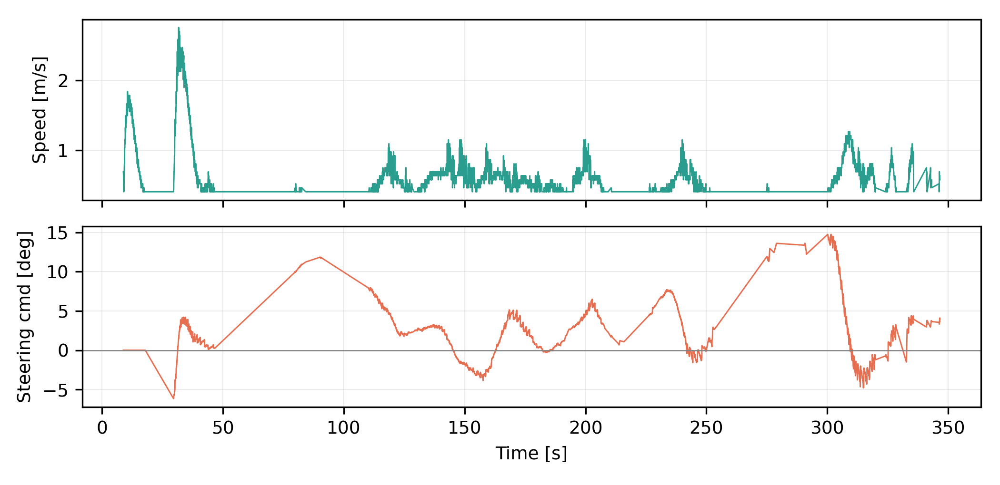

# RTK-GNSS 기반 저비용 자율주행 플랫폼의 실시간 측위 시스템 구현

## A Real-Time Localization System for a Low-Cost Autonomous Driving Platform Based on RTK-GNSS

홍 길 동\*ㆍ한국교통대학교 ○○공학과 학부생

\* 교신저자 : 성명, 소속, 직위 / E-mail

---

## 요 약

자율주행 차량의 경로 추종 성능은 측위 정확도에 직접 의존한다. 본 연구는 소형 전동 차량을 개조한 저비용 자율주행 플랫폼에 RTK-GNSS(Real-Time Kinematic GNSS) 기반 실시간 측위 시스템을 구현하고 실차 주행으로 검증하였다. 국토지리정보원 VRS(Virtual Reference Station) 보정을 NTRIP으로 수신해 cm급 측위를 확보하였으며, 이 과정에서 기존 ROS 2 패키지가 지원하지 않는 GGA 상향 전송 기능을 갖춘 전용 클라이언트를 구현하였다. 또한 자력계 오차로 지도 좌표계에 정렬되지 않는 IMU 방위각 문제를 해결하기 위해, 직진 구간의 GNSS 이동방향을 참값으로 삼아 방위각 오프셋을 추정하고 방위각 변화량 기반 폐루프 제어로 직진성을 확보하는 초기화 기법을 적용하였다. 센서 두절 시에는 마지막 위치를 유지하지 않고 측위 발행을 중단해 하위 제어기가 안전 정지하도록 설계하였다. 실차 시험에서 RTK Fixed 유지율 94.8%, 수평정확도 평균 1.4cm, 방위각 오차 1.02°를 얻었으며, 경로 추종 횡방향 오차는 직선 구간에서 평균 3~14cm였다.

**핵심어 :** RTK-GNSS, NTRIP, 자율주행, 측위, 방위각 초기화

---

## ABSTRACT

The path-tracking performance of an autonomous vehicle depends directly on its localization accuracy. This study implements and field-validates a real-time localization system based on RTK-GNSS for a low-cost autonomous driving platform converted from a small electric vehicle. Centimeter-level positioning was obtained by receiving Virtual Reference Station corrections from the National Geographic Information Institute over NTRIP; because the NTRIP client bundled with the existing ROS 2 package does not transmit the NMEA GGA sentences that the VRS service requires to generate corrections for the rover location, a dedicated client providing this capability was implemented so that the receiver converges to an RTK Fixed solution. To resolve the misalignment between the map frame and the yaw angle of a low-cost IMU affected by magnetometer error, an initialization method was applied that estimates the yaw offset by treating the GNSS course over a straight segment as the true heading; although the absolute heading is unknown at initialization, the change in heading is measured accurately by the IMU, so a closed-loop controller maintaining the initial yaw keeps the vehicle straight without knowing the absolute heading. For safety, the system stops publishing localization output when sensor data is interrupted rather than holding the last known pose, so that downstream modules detect the condition by timeout and stop the vehicle safely. Field tests achieved an RTK Fixed rate of 94.8%, a mean horizontal accuracy of 1.4 cm, and a heading error of 1.02 degrees, with a lateral tracking error of 3 to 14 cm on straight sections.

**Keywords :** RTK-GNSS, NTRIP, autonomous driving, localization, heading initialization

---

## Ⅰ. 서 론

### 1. 연구 배경 및 목적

자율주행 시스템은 인지(perception), 측위(localization), 판단·제어(planning and control)로 구성되며, 측위 오차는 그대로 경로 추종 오차로 전이된다. 차선 폭이 좁은 주행 환경에서는 수십 cm의 오차도 차선 이탈로 이어진다.

측위 방식은 GNSS 기반, LiDAR·카메라 기반 SLAM, 그리고 이들의 융합으로 구분된다. SLAM 기반 방식은 GNSS 음영에서도 동작하나 사전 지도 구축과 연산 자원을 요구한다(Kim et al., 2019). 반면 개활지에서는 RTK-GNSS만으로 cm급 정확도를 얻을 수 있어 저비용 플랫폼에 적합하다.

RTK는 반송파 위상 관측치의 미지정수를 해결해 cm급 정확도를 달성하며, 미지정수가 정수로 확정된 RTK Fixed와 실수로 남은 RTK Float의 정확도 차이는 수 cm 대 수십 cm로 크다. 보정 신호 전달에는 NTRIP(Networked Transport of RTCM via Internet Protocol)이 표준으로 쓰이며(RTCM, 2011), 다수 상시관측소 관측치로 이동체 근처에 가상 기준국을 만드는 VRS 방식이 기선 길이 문제를 완화한다.

한편 단일 안테나 GNSS는 위치는 제공하나 방위각을 직접 제공하지 않는다. 이중 안테나 방식은 정확하나 추가 수신기가 필요하고, 자력계는 모터가 근접한 소형 플랫폼에서 오차가 크다.

본 연구는 유아용 전동 차량을 개조한 저비용 플랫폼을 대상으로, VRS 기반 RTK 측위와 GNSS 이동방향 기반 방위각 초기화를 구현하고 실차 주행으로 검증한 사례를 보고한다.

### 2. 연구의 기여

본 연구의 기여는 다음과 같다.

1) VRS 보정 수신에 필요한 GGA 상향 전송을 포함한 NTRIP 클라이언트를 구현하여 기존 ROS 2 패키지의 제약을 해소하였다.

2) GNSS 이동방향 기반 방위각 초기화에 **방위각 변화량 기반 폐루프 직진 제어**를 결합하여 초기화 신뢰성을 확보하였다.

3) 센서 두절 시 측위 발행을 중단하는 안전 지향 설계를 적용하고 실주행에서 그 동작을 확인하였다.

---

## Ⅱ. 시스템 구성

### 1. 하드웨어

<Table 1> Hardware configuration

| Component | Specification | Note |
|---|---|---|
| Vehicle platform | HENES T870, wheelbase 0.785 m | Modified electric ride-on car |
| GNSS receiver | u-blox ZED-F9P | Multi-band, RTK capable |
| IMU | HandsFree A9 | 300 Hz |
| MCU | Arduino Mega 2560 | Low-level drive/steering control |
| Onboard computer | Laptop PC | ROS 2 Humble |

축거는 자전거 모델 기반 조향각 산출에 직접 사용되므로 실측하였다(0.785m).

### 2. 소프트웨어 구성

시스템은 ROS 2 Humble 기반이며 측위 데이터 흐름은 <Fig. 1>과 같다. NTRIP 클라이언트가 캐스터에 GGA를 상향 전송하고 RTCM 보정을 수신해 수신기에 주입하며, 측위 노드가 위치와 방위각을 결합해 주행 좌표계 상태를 발행한다.

<Fig. 1> Node and topic graph of the localization system

---

## Ⅲ. RTK 측위 구현

### 1. GGA 상향 전송

VRS 서비스는 이동체 위치 기준으로 가상 기준국을 생성하므로 이동체가 개략 위치를 캐스터에 알려야 한다. 그러나 `ublox_dgnss` 패키지의 기본 NTRIP 클라이언트는 RTCM 하향 수신만 지원하고 GGA 상향 전송 기능이 없다.

이에 GGA 전송을 포함한 클라이언트를 구현하였다. 동작은 (1) 캐스터에 HTTP Basic 인증으로 접속, (2) 이동체 위치를 NMEA GGA로 구성해 1초 주기로 전송, (3) 수신 RTCM3를 프레임 단위로 분리해 발행, (4) 수신기에 주입하여 RTK Fixed로 수렴하는 순서다.

초기에는 `/fix`가 있어야 GGA를 보낼 수 있고 GGA를 보내야 정밀한 `/fix`를 얻는 순환 의존이 존재하였다. 시험장 근방 고정 좌표를 파라미터로 두어 초기 GGA를 생성함으로써 이를 해소하였다. VRS는 수 km 범위에서 유효하므로 개략 좌표로 충분하다.

### 2. 좌표 변환

위경도(WGS84)를 UTM Zone 52N으로 투영하고 사전 정의한 원점을 감산해 지역 좌표를 구성한다.

$$(x, y) = \mathcal{T}_{UTM52N}(\lambda, \phi) - (x_0, y_0)$$

지역 원점은 경로 기록 노드와 측위 노드가 완전히 동일한 값을 사용해야 한다. 두 값이 다르면 전역 경로 전체가 평행이동한다. 본 연구 초기에는 이 값이 다섯 곳에 개별 정의되어 있었고, 시험 장소 변경 시 일부만 갱신되어 지역 좌표가 약 150km 어긋나는 오류가 발생하였다. 이후 단일 설정 파일로 통합하여 재발을 방지하였다.

---

## Ⅳ. 방위각 초기화

### 1. GNSS 이동방향 기반 오프셋 추정

차량이 직진할 때 GNSS 위치 변화 방향은 실제 방위각과 일치한다. 이를 이용해 오프셋을 산출한다.

$$course = atan2(\Delta n, \Delta e)$$
$$\psi_{offset} = normalize(course - \psi_{IMU})$$

여기서 $\Delta e, \Delta n$은 시작점 대비 동·북 방향 변위이다. 산출된 오프셋은 래치 토픽으로 발행되어 초기화 노드 종료 후에도 측위 노드가 참조한다. 초기화 거리는 10m로 설정하였다. 거리가 짧으면 GNSS 잡음 대비 변위 비율이 작아 추정 오차가 커진다.

### 2. 폐루프 직진 제어

초기화의 전제는 차량이 곧게 주행하는 것이다. 초기 시험에서 사람이 밀거나 원격 조종한 경우 궤적 방향 편차가 43°, 157°로 측정되어 직진성 검증에서 연속 거부되었다.

여기서 핵심은 다음과 같다. **방위각의 절대값은 아직 알 수 없으나(그것을 구하는 것이 목적이다) 출발 시점 대비 변화량은 IMU로 정확히 알 수 있다.** 따라서 출발 시점의 방위각을 유지하는 폐루프 제어는 절대 방위각을 몰라도 성립한다. 조향각 0°를 인가하는 개루프 방식은 조향 중립값이 조금만 어긋나도 궤적이 휘어 검증에 실패하나, 폐루프 방식은 이러한 기구적 편차를 자동 보상한다.

### 3. 센서 두절에 대한 안전 설계

초기 구현에서는 GNSS가 끊겨도 마지막 위치를 계속 발행하였다. 이 경우 차량은 이동하나 측위 출력은 고정되어 하위 모듈이 이상을 감지하지 못한다. 이를 다음과 같이 변경하였다.

- `/fix`가 설정 시간(1.0초) 이상 수신되지 않으면 측위 발행을 중단한다.
- IMU에도 동일한 감시를 적용한다. 실제로 주행 중 IMU 프로세스는 살아 있으나 데이터 송신이 멈추는 사례가 관측되었다.
- 발행이 중단되면 하위 모듈이 타임아웃으로 안전 정지한다.

---

## Ⅴ. 실험 및 결과

### 1. 시험 환경 및 방법

한국교통대학교 충주캠퍼스 구내 총연장 99.6m의 순환 경로에서 실차 주행 시험을 수행하였다. 경로는 차량을 수동 주행하며 GNSS 위치를 0.5m 간격으로 기록하여 생성하였고, 차량의 최소 회전반경(2.42m)보다 급한 구간을 제거하기 위해 곡률 제약 평활화를 적용하였다. RTK 보정은 국토지리정보원 VRS를 통해 수신하였다.

주행 중 측위 출력, 경로 추종 오차, RTK 해 상태, 조향 명령을 20Hz로 기록하였다. 전체 10308개 표본 중 차량이 실제로 주행한 구간(속도 0.4m/s 이상) 4960개 표본을 분석 대상으로 하였다. 주행 시간은 338초, 평균 속도는 0.69m/s(2.5km/h)였다.

### 2. 측위 정확도

#### 1) RTK 해 상태별 정확도

<Table 2> Localization and tracking performance by RTK solution status

| Status | n | Ratio | Horizontal accuracy | Lateral error |
|---|---|---|---|---|
| FIX | 4704 | 94.8% | 0.014 m | 0.309 m |
| FLOAT | 211 | 4.3% | 0.281 m | 0.977 m |
| SINGLE | 45 | 0.9% | 0.768 m | 0.235 m |

RTK Fixed 상태가 전체 주행의 94.8%를 차지하였으며, 이 구간의 수평정확도는 평균 1.4cm였다. 반면 RTK Float 구간에서는 수평정확도가 28.1cm로 약 20배 저하되었고, 경로 추종 횡방향 오차 또한 0.31m에서 0.98m로 3배 증가하였다(<Fig. 2>). Single 구간은 표본이 45개로 적어 통계적 의미가 제한적이다.

<Fig. 2> Localization and tracking error by RTK solution status

주목할 점은 Float 구간의 횡방향 오차 중앙값이 1.073m라는 것이다. 이는 오차가 산발적으로 튄 것이 아니라 해당 구간 전반에 걸쳐 지속적으로 경로를 벗어났음을 의미한다. 시간축에서 이를 확인하면 <Fig. 3>과 같이 RTK 해가 저하되는 구간과 횡방향 오차가 증가하는 구간이 명확히 일치한다.

<Fig. 3> Time series of lateral error with RTK solution status

이 결과는 RTK Fixed 유지가 측위 정확도뿐 아니라 경로 추종 성능까지 직접 좌우함을 보여준다. 따라서 실주행에서는 Fixed 유지율을 성능 지표로 함께 관리할 필요가 있다.

#### 2) 방위각 초기화 효과

<Table 3> Heading error before and after initialization

| Condition | n | Median | Std. dev. |
|---|---|---|---|
| Before initialization | 225 | -134.71° | 10.32° |
| After initialization | 4627 | +1.02° | 8.86° |

방위각 오프셋이 적용되기 전 구간에서 보고 방위각과 GNSS 이동방향의 차이는 중앙값 -134.71°였다. 이는 IMU 자력계가 지도 좌표계와 정렬되어 있지 않다는 것을 정량적으로 보여준다. Ⅳ장의 초기화 기법을 적용한 이후에는 중앙값 +1.02°로 감소하였다(<Fig. 4>).

<Fig. 4> Histogram of heading error before and after initialization

초기화 전 분포가 −135° 부근에 좁게(표준편차 10.3°) 모여 있다는 점은, 오차가 무작위 잡음이 아니라 일정한 오프셋임을 의미한다. 즉 자력계 방위각은 지도 좌표계에 대해 일정하게 회전되어 있으며, 이 회전량을 한 번 추정하면 보정이 가능하다는 본 연구의 전제가 실측으로 확인되었다.

### 3. 경로 추종 성능

#### 1) 주행 궤적

기준 경로와 실제 주행 궤적의 비교는 <Fig. 5>와 같다. 궤적의 색상은 각 지점의 횡방향 오차 크기를 나타낸다.

<Fig. 5> Vehicle trajectory colored by lateral tracking error

#### 2) 오차 분포

<Table 4> Distribution of lateral tracking error

| Group | n | Mean | Median | 90th | 95th | Max |
|---|---|---|---|---|---|---|
| All (moving) | 4960 | 0.336 | 0.182 | 1.064 | 1.107 | 1.336 |
| RTK Fixed | 4704 | 0.309 | 0.175 | 0.999 | 1.103 | 1.157 |
| RTK Float | 211 | 0.977 | 1.073 | 1.084 | 1.333 | 1.336 |

(단위: m)

전체 주행의 횡방향 오차 중앙값은 0.182m였다. 평균(0.336m)이 중앙값보다 큰 것은 소수 구간의 큰 오차가 분포를 끌어올린 결과이며, 누적분포로 보면 <Fig. 6>과 같이 대부분의 표본이 낮은 오차 영역에 집중되어 있다.

<Fig. 6> Cumulative distribution of lateral error by RTK status

#### 3) 곡률에 따른 추종 성능

<Table 5> Tracking error by path curvature

| Curve radius | n | Mean error | 95th | Max |
|---|---|---|---|---|
| < 3.5 m (sharp) | 64 | 0.983 | 0.993 | 0.994 |
| 3.5–10 m | 727 | 0.355 | 0.990 | 0.997 |
| 10–30 m | 1394 | 0.132 | 0.408 | 0.983 |
| > 30 m (straight) | 2518 | 0.376 | 1.138 | 1.157 |

(단위: m)

곡률반경 10~30m 구간에서 평균 오차가 0.132m로 가장 양호하였고, 3.5m 미만의 급커브에서는 0.983m로 가장 컸다. 곡률반경과 오차의 관계를 표본 단위로 보면 <Fig. 7>과 같다.

<Fig. 7> Scatter plot of curve radius versus lateral error

여기서 곡률반경 30m 이상의 직선 구간에서 평균 오차가 0.376m로 나타난 점은 해석에 주의가 필요하다. 이는 직선 구간 자체의 추종 성능이 아니라, **급커브에서 이탈한 뒤 회복하는 구간이 곡률 기준으로 직선으로 분류되기 때문**이다. 경로 인덱스 기준으로 구간별 오차와 최소 곡률반경을 함께 보면 이 관계가 드러난다(<Fig. 8>).

<Fig. 8> Lateral error and minimum curve radius by path segment

경로 중간부(인덱스 80~139)에서는 오차가 0.035~0.061m로 매우 낮은 반면, 곡률반경 3.03m의 급커브 구간(인덱스 160~179)에서 0.871m로 증가하고, 그 직후 직선 구간(180~199)에서도 1.076m가 유지되었다. 즉 급커브에서 발생한 이탈이 이어지는 직선 구간에서 즉시 회복되지 않았다.

이 현상의 원인은 추종 제어의 lookahead 거리에 있다. 주행 속도 0.7m/s에서 lookahead는 최소값인 2.3m가 적용되는데, 이는 급커브의 곡률반경 3.03m에 육박하는 값이다. lookahead가 곡률반경과 비슷하면 pure pursuit는 코너를 늦게 인식하고, 이탈 후 복귀도 느려진다. 이는 측위 정확도의 문제가 아니라 추종 제어 파라미터가 경로 기하와 맞지 않아 발생한 문제이며, 측위 출력이 정확하더라도 하위 제어 설정에 따라 추종 오차가 발생할 수 있음을 보여준다.

#### 4) 조향 여유

<Fig. 9> Speed and steering command profile during the lap

주행 중 조향 명령의 절대평균은 3.09°, 최대값은 14.74°로 물리적 한계인 18°에 도달하지 않았으며, 조향 포화는 0회 발생하였다(<Fig. 9>). 이는 Ⅲ장에서 적용한 곡률 제약 경로 평활화가 유효하게 작동하여 전 구간이 차량의 기구학적 한계 내에서 추종 가능하였음을 의미한다. 평활화 이전 경로에는 곡률반경 1.73m, 1.91m 구간이 존재하여 각각 24.4°, 22.4°의 조향각을 요구하였으므로, 평활화가 없었다면 해당 구간에서 조향이 포화된 채 이탈이 불가피하였을 것이다.

### 4. 안전 설계 동작 확인

주행 중 IMU 데이터 두절이 발생하였고, Ⅳ장 3절의 설계대로 측위 발행이 중단되어 하위 제어기가 타임아웃으로 차량을 정지시켰다. 두절 원인은 USB 허브를 다단으로 경유한 연결 구성으로 확인되었으며, 커널 로그에 통신 오류(`urb stopped: -32`)가 반복 기록되었다.

만약 마지막 위치를 유지하는 방식이었다면 차량은 고정된 방위각으로 계속 주행하여 경로를 크게 이탈하였을 것이다. 데이터의 부재를 명시적으로 전파하여 하위 모듈이 인지하도록 한 설계가 실주행에서 유효하게 작동함을 확인하였다.

### 5. 종합

<Table 6> Summary of the test run

| Item | Value |
|---|---|
| Path length | 99.6 m (closed loop) |
| Driving time | 338 s |
| Mean speed | 0.69 m/s (2.5 km/h) |
| RTK Fixed rate | 94.8% |
| Horizontal accuracy (Fixed) | 0.014 m |
| Heading error after initialization | +1.02° |
| Lateral error (median) | 0.182 m |
| Lateral error on straight sections | 0.035–0.142 m |
| Max steering command | 14.74° (limit 18°) |
| Steering saturation events | 0 |

---

## Ⅵ. 결론

본 연구는 저비용 자율주행 플랫폼에 RTK-GNSS 기반 실시간 측위 시스템을 구현하고 실차 주행으로 검증하였다. 주요 결과는 다음과 같다.

1) VRS 보정 수신을 위해 GGA 상향 전송을 포함한 NTRIP 클라이언트를 구현하여 RTK Fixed 유지율 94.8%, Fixed 구간 수평정확도 1.4cm를 달성하였다.

2) GNSS 이동방향 기반 방위각 초기화에 방위각 변화량 기반 폐루프 직진 제어를 결합하여, 초기화 후 방위각 오차 1.02°를 얻었다.

3) 센서 두절 시 측위 발행을 중단하는 설계가 실주행에서 의도대로 동작하여 안전 정지를 유도함을 확인하였다.

향후 과제로는 (1) 기준점 측량 성과를 이용한 절대 정확도 평가, (2) RTK Fixed/Float 전환이 추종 오차에 미치는 영향의 정량 분석, (3) 급커브 구간의 lookahead 적응 기법 적용, (4) GNSS 음영 구간 대응을 위한 추측항법 결합이 있다.

---

## 참고문헌

1. Kim, D. G., Park, J. H. and Lee, C. W.(2019), "A study on localization for autonomous driving using LiDAR-based SLAM", *Journal of Korean Society of Intelligent Transport Systems*, vol. 18, no. 4, pp.1-12.

2. Korea Expressway Corporation, http://www.ex.co.kr, 2026.08.23.

3. National Geographic Information Institute(2024), *Guide to Real-Time GNSS Data Service* (위성기준점 실시간 데이터 서비스 이용 안내).

4. RTCM Special Committee No. 104(2011), *Networked Transport of RTCM via Internet Protocol (Ntrip) Version 2.0*, RTCM.

5. RTCM Special Committee No. 104(2016), *RTCM Standard 10403.3 for Differential GNSS Services*, RTCM.

6. u-blox AG(2022), *ZED-F9P Integration Manual*, u-blox.
